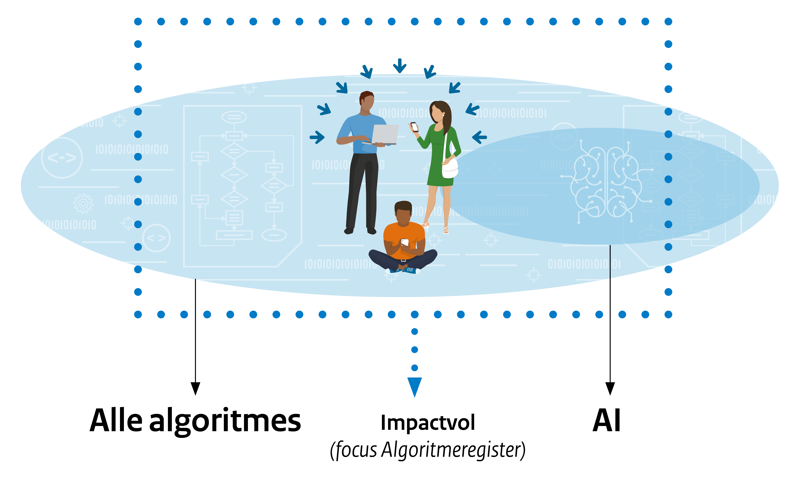

Op deze pagina geven we een overzicht van definities die gehanteerd worden door het Algoritmekader. Deze definities komen overeen met de definities zoals die geformuleerd zijn voor het [Algoritmeregister](https://algoritmes.overheid.nl/nl). De informatie op deze pagina is afkomstig uit de [Handreiking Algoritmeregister](https://algoritmes.pleio.nl/attachment/entity/83fb2500-6b45-434d-93c9-7534e0b740b3).

### Definitie van een algoritme
Er zijn veel definities van een algoritme. Voor het algoritmekader hanteren we de definitie van de Algemene Rekenkamer:

> 'Een set van regels en instructies die een computer geautomatiseerd volgt bij het maken van berekeningen om een probleem op te lossen of een vraag te beantwoorden.’

Dit is een brede definitie die de maximale reikwijdte weergeeft van algoritmes waarvoor het Algoritmekader relevant is. Waar de definitie van de Algemene
Rekenkamer schrijft “om een probleem op te lossen of een vraag te beantwoorden”, verstaan we daar ook onder “om een taak of proces uit te voeren of tot
een besluit te komen”. In het uitvoeren van een taak of het komen tot een besluit kunnen één of meer algoritmes voorkomen. Daarnaast hebben we het bij het Algoritmekader over zowel Artificiële Intelligentie (AI) als algoritmes. De essentie is dat AI is opgebouwd uit algoritmes. Maar niet alle algoritmes zijn AI. 

!!! opmerking "Gebruikte terminologie"
    De termen hoog-risico, impactvol, AI en Algoritmes worden veel door elkaar gebruikt.
    Wij hanteren uitsluitend de volgende twee termen:

    1. **Hoog-risico AI (-systeem)** 
    Hiermee bedoelen we altijd de definitie zoals deze in
    de AI-verordening wordt gehanteerd.

    2. **Impactvolle algoritmes**
    Dit betreft de minimale reikwijdte van het Algoritmekader.
    Het omvat de hoog-risico AI-systemen zoals gedefinieerd in de AI-verordening én
    de algoritmes die we daarnaast als impactvol beschouwen. 

## Relatie scope Algoritmekader en de AI-Verordening
Op dit moment wordt op EU-niveau de AI-verordening ontwikkeld, die naar verwachting van toepassing wordt op een deel van de algoritmes in gebruik bij de overheid. In de
AI-verordening zijn AI-systemen onderverdeeld in verschillende categorieën: verboden praktijken, hoog-risico AI-systemen, AI-systemen met manipulatierisico’s en AI-systemen
met geen/minimale risico’s. Afhankelijk van de categorie waarin een AI-systeem valt, gelden zwaardere of minder zware eisen waar die systemen aan moeten voldoen.

Het Algoritmekader is hoe dan ook relevant voor hoog-risico AI-systemen volgens de definitie van de AI-verordening. Een AI-systeem is hoog-risico als het voldoet
aan de volgende eisen:
1. Het AI-systeem valt onder de definitie van AI-systemen in artikel 3 lid 1 van de
verordening en moet o.a. autonome elementen bevatten, en

2. Het AI-systeem wordt in een van de toepassingsgebieden van ANNEX III ingezet
zoals biometrie, kritieke infrastructuur en rechtshandhaving. Bovenstaande betreft een versimpelde beschrijving van de AI-verordening. In bijlage 2 van de [Handreiking Algoritmeregister](https://algoritmes.pleio.nl/attachment/entity/83fb2500-6b45-434d-93c9-7534e0b740b3) is meer informatie te vinden over de AI-verordening. Aangezien de AI-verordening nog in onderhandeling is, bestaat de kans dat de classificatie van hoog-risico AI-systemen nog wordt aangepast. 

### Definitie van impactvolle algoritmes
Om te bepalen of een algoritme in aanmerking komt voor publicatie in het Algoritmeregister, is een hulpmiddel 'Selectie' gemaakt. Het zijn dezelfde algoritmes die relevant zijn voor het Algoritmekader. Dit hulpmiddel wordt hieronder weergegeven in de figuur, en is ook leidend voor het Algoritmekader.

![Hulpmiddel selectie publicatie Algoritmeregister 
Wél publicatie in het register als: 
*  Hoog risico volgens AI-Act 
** Hoogrisico algoritmes volgens de voorlopige definitie van de AI-Act in 8 toepassingsgebieden. 
* Impact op betrokkenen 
** Algoritme heeft directe rechtsgevolgen voor betrokkenen 
** Algoritme beïnvloedt hoe de overheid een betrokkenen of groep classificeert. 

Mogelijke publicatie:
* Andere overwegingen 
** demystificatie 
** Maatschappelijk debat
** Media aandacht 
** Toezichthouder 
** Vragen van burgers of media 
** Onderdeel van een Woo-verzoek 

Mogelijke uitzonderingsgronden. In uitzonderlijke gevallen worden algoritmes maar gedeeltelijk of helemaal niet gepubliceerd. 
* Wettelijke uitzonderingsgronden zoals in de Wet open overheid of de Wet politiegegevens 
* 'Gaming the System'  
* Valt buiten categorie A t/m C ](5113 Infogr Publicatie in Algoritmeregister (002).jpg)

Voor meer toelichting over dit hulpmiddel verwijzen we naar de [Handreiking Algoritmeregister](https://algoritmes.pleio.nl/attachment/entity/83fb2500-6b45-434d-93c9-7534e0b740b3). 

!!! info "Disclaimer"

    Het Algoritmekader is nog volop in ontwikkeling. Op deze plek willen we vooral aan de slag gaan op een open en transparante wijze. Het is dus niet definitief. Dat betekent dat er dingen opstaan die niet af zijn en soms zelfs fout. Mocht er iets niet kloppen, laat het ons weten via [GitHub](https://github.com/MinBZK/Algoritmekader).
